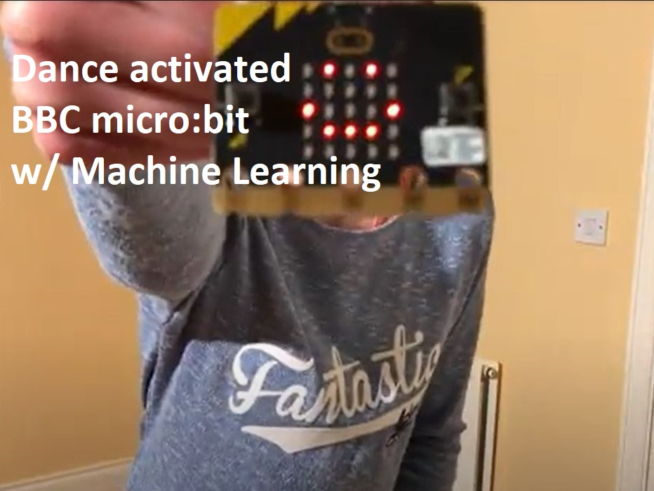

# Dance activated micro:bit

A demo application that makes your micro:bit V2 model respond to TikTok dance moves, built with Edge Impulse. This demo uses Machine Learning to analyse the accelerometer data coming from the micro:bit on-board sensor, showing a smiley on the display when it recognises "Floss" TikTok moves.



Detailed instructions for the project are available on the [OKdo Project Hub](TBA)

1. Clone this repository:

    ```
    $ git clone https://github.com/LetsOKdo/dance-activated-microbit
    ```
1. Change to project directory:

    ```
    $ cd dance-activated-microbit
    ```

## Build using Docker (tested on GNU/Linux Debian 11)
1. Install Docker for your host [Get Docker](https://docs.docker.com/get-docker)

1. Build the container:

    ```
    $ docker build -t microbit_dance_detector .
    ```

1. Build the project:

    **macOS, Linux**

    ```
    $ docker run --rm -v $PWD:/data microbit_dance_detector
    ```

    **Windows**

    ```
    $ docker run --rm -v "%cd%":/data microbit_dance_detector
    ```

## Build natively (tested on GNU/Linux Debian 10 with gcc-arm-none-eabi-9-2020-q2-update)

1. Install [CMake](https://cmake.org), [Python 2.7](https://www.python.org) and the [GNU ARM Embedded Toolchain](https://developer.arm.com/tools-and-software/open-source-software/developer-tools/gnu-toolchain/gnu-rm) and [Ninja](https://ninja-build.org). Make sure `arm-none-eabi-gcc` and the other components are in your PATH.

1. Build the project:

    ```
    $ python build.py
    ```

## Flash the image:

1. Plug in your micro:bit to the host with a micro USB cable (the microbit should be visble as a mass storage device in your filemanager)

1. Flash the binary to your micro:bit by dragging `MICROBIT.hex` onto the `MICROBIT` disk drive or copy the one from this repo.

## Dance

1. Detach your micro:bit and connect it to the battery pack

1. The center LED on the matrix will light up showing that the micro:bit is ready to detect your dance moves

1. Start dancing the "Floss dance" and if you do it right the matrix will light up with a smiley face

1. The detection will reset automatically after a few seconds

## How to recognise new dances

You can build new models using [Edge Impulse](https://docs.edgeimpulse.com/docs).

1. [Sign up for an account](https://studio.edgeimpulse.com) and open your project.
1. Install Edge Impulse tools from the command window

  ```
  $ npm install -g edge-impulse-cli
  ```
1. Set up one micro:bit as a [dance move transmitter](https://github.com/LetsOKdo/microbit-dancemove-transmitter)
1. Set up another micro:bit as a [dance move receiver](https://github.com/LetsOKdo/microbit-dancemove-receiver)
1. Follow the [Data Forwarder](https://docs.edgeimpulse.com/docs/cli-data-forwarder) instructions
1. Go back to **Data acquisition** and now collect your dance move data.
1. Follow [these steps](https://docs.edgeimpulse.com/docs/audio-classification#4-design-an-impulse) to train your model.

    > Note: use window length 999 instead of 1000!

Once you've trained a model go to **Deployment**, and select **C++ Library**. Then:

1. Remove `source/edge-impulse-sdk`, `source/model-parameters` and `source/tflite-model`.
1. Drag the content of the ZIP file into the `source` folder.
1. If you've picked a different keyword, change this in [source/AccelerometerInferenceTest.cpp](source/AccelerometerInferenceTest.cpp).
1. Rebuild your application.
1. Your micro:bit now responds to your own TikTok moves 🚀.

There's an excellent video tutorial on using Edge Impulse here:

[Voice-activated micro:bit](https://www.youtube.com/watch?v=fNSKWdIxh8o&feature=youtu.be)
